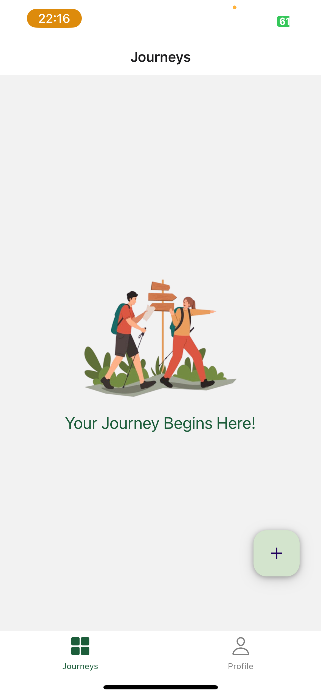
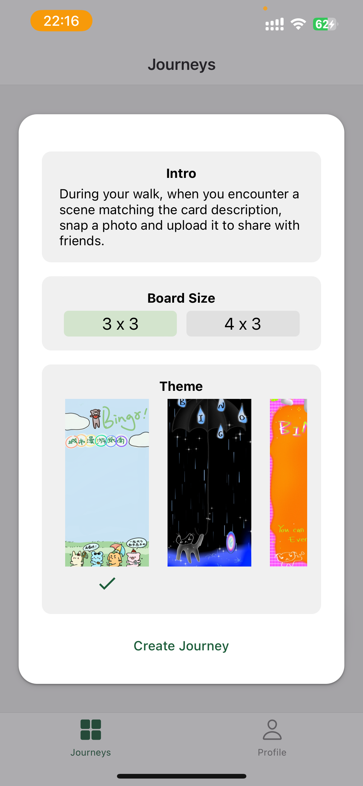

# Walking-Master

## Team member:
Hanzhang Peng, Zixiang Hu

### Functionalities added in this iteration:
- Location use
    - When user upload their image, they could set location to denote where they snapped the images.
    - When checking other people's uploaded image, they could click the map icon to view its location. Besides, they could check nearby parks through clikcing nearbyPark button.


- External API use
    - The external api used is google nearby search api.
    - User could set its location through picking nearby location.

### FireStore Rules
```
rules_version = '2';

service cloud.firestore {
  match /databases/{database}/documents {

    // This rule allows anyone with your Firestore database reference to view, edit,
    // and delete all data in your Firestore database. It is useful for getting
    // started, but it is configured to expire after 30 days because it
    // leaves your app open to attackers. At that time, all client
    // requests to your Firestore database will be denied.
    //
    // Make sure to write security rules for your app before that time, or else
    // all client requests to your Firestore database will be denied until you Update
    // your rules
    match /{document=**} {
      allow read: if true;
      allow write, update, delete: if request.auth != null;
    }
  }
}
```

### Storage Rules
```
rules_version = '2';

// Craft rules based on data in your Firestore database
// allow write: if firestore.get(
//    /databases/(default)/documents/users/$(request.auth.uid)).data.isAdmin;
service firebase.storage {
  match /b/{bucket}/o {

    // This rule allows anyone with your Storage bucket reference to view, edit,
    // and delete all data in your Storage bucket. It is useful for getting
    // started, but it is configured to expire after 30 days because it
    // leaves your app open to attackers. At that time, all client
    // requests to your Storage bucket will be denied.
    //
    // Make sure to write security rules for your app before that time, or else
    // all client requests to your Storage bucket will be denied until you Update
    // your rules
    match /{allPaths=**} {
      allow read: if true;
      allow write, update, delete: if request.auth != null;
    }
  }
}
```
### Components / Screen that we work on
Hanzhang Peng:
- Login screen
- Signup screen
- Profile screen
- Notification screen
- CustomButton
- Bottom Navigator

Zixiang Hu:
- Game screen
- Create game screen
- Game board screen
- Tile
- Modal
- GameCard
- Floating Action Button

### Data Model & Collection


### CRUD
For each of the collection, there are three basic CRUD operation, create, read and update.
Delete is only supported for the game collection. Furthermore, for game colleciton, we had an extra function that keeps listening its update. The detailed implementation could be found from firestoreHelper.js.

## Screen shots
Main page


Add game page


